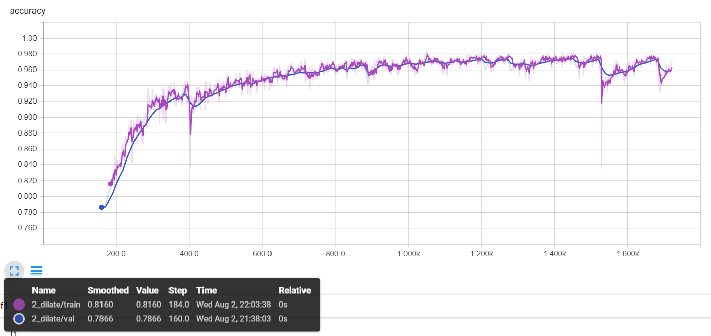
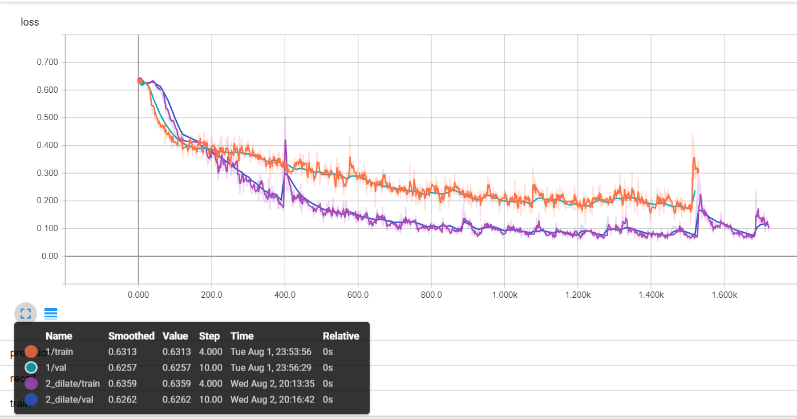

A solution for <https://www.kaggle.com/c/carvana-image-masking-challenge>  
Model with strided, dilated, and transposed convolutions.

Notebook might have a lot of images so it takes a while to load.

## Tensorboard graphs
I was changing the logging during training, so there's some gaps in the data

Accuracy

Loss  

